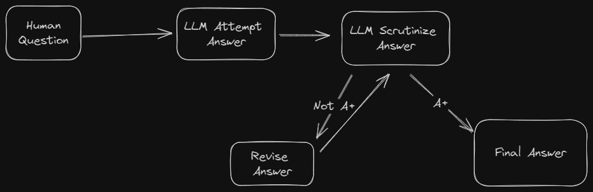

# Self Evaluating LLM with LangGraph



## Getting Started

Example requires a locally running [Ollama](https://ollama.com) instance with `mistral` available.

```bash
# assumes ollama is already running
# clone the repo
git clone git@github.com:CuriouslyCory/self-evaluating-langgraph.git
cd self-evaluating-langgraph

# install dependencies
npm i

# run local development server
npm run dev
```

Then Browse to `http://localhost:3000/` to see the app.

You can change the model from mistral to your choice in [`src/server/api/routers/post.ts`](src/server/api/routers/post.ts).

## About

This is a [T3 Stack](https://create.t3.gg/) project bootstrapped with `create-t3-app`.
Also proudly using

- shadcn/ui for the UI primatives.
- LangChain
- LangGraph
